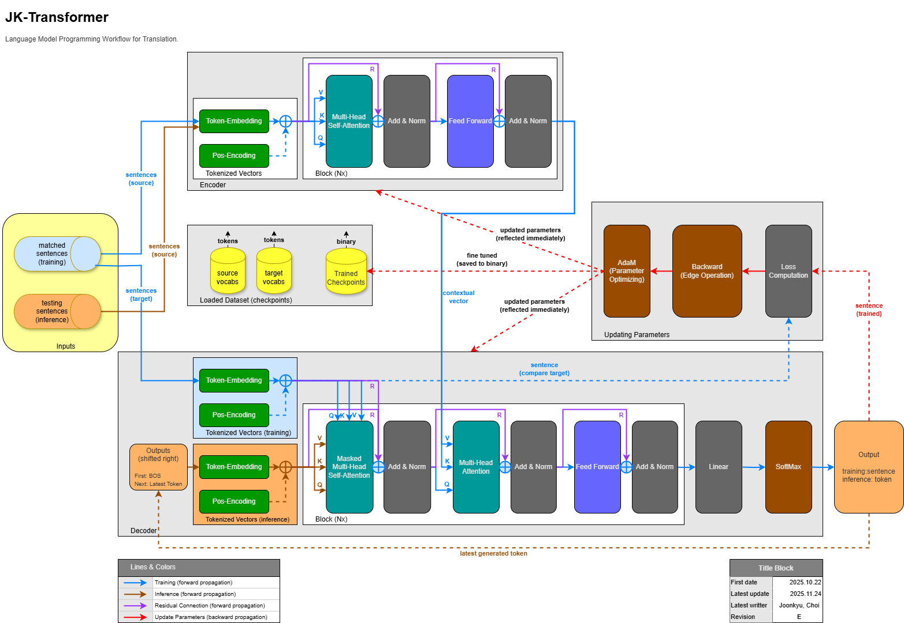

# 블로그 게시물 작성

본 문서는 [개인 블로그 사이트](https://blog.jk-dreams.com/) 게시용 정보를 보관한 것이다.



## Title
JK-Transformer

## Sub-Title
C++ Transformer Engine (Optimized for MSVC 2022 and gcc)

## Tag
portfolio

## 개발 정보
```
- 개발 이력
  [2026.04.03 ~ 2026.04.03] GitHub 등록 (Portfolio 목적)
  [2025.10.22 ~ 2025.11.24] 설계도(drawio) 작성
  [2025.03.24 ~ 2025.08.02] 영한·영일 기계번역 기반 모델을 C++ Transformer로 구축
- 개발 언어
  > C/C++/VC++
- 데이터 관리
  > File
- 통신
  > None
```

## 설명
```markdown
본 게시물은 `Portfolio` 목적으로 [GitHub](https://github.com/JoonkyuChoi/JK-Transformer)에 공개하였으며, 현재 소스코드는 포함되어 있지 않습니다.
License 검토 및 정비 단계에 있어, 소스코드를 직접 공개하지 않습니다.
대신에, 개발 과정에서의 설계 역량과 결과물을 증명하기 위해, 아래의 **2차적 저작물** 및 산출물을 공개합니다.

공개 범위:
* **데이터셋:** 어휘 사전(Vocabulary), 매칭 문장 사전, 추론용 테스트 문장
* **빌드 결과물:** 실행 가능한 바이너리 파일, 사전 훈련된 모델 파일(`.bin`)
* **문서화 자료:** 상세 설계 도면 및 학습 로그를 포함한 기술 문서

License 이슈가 해결되는 시점에 맞춰, 추후 코드 공개 여부를 결정할 예정입니다.
양해 부탁드립니다.
```
