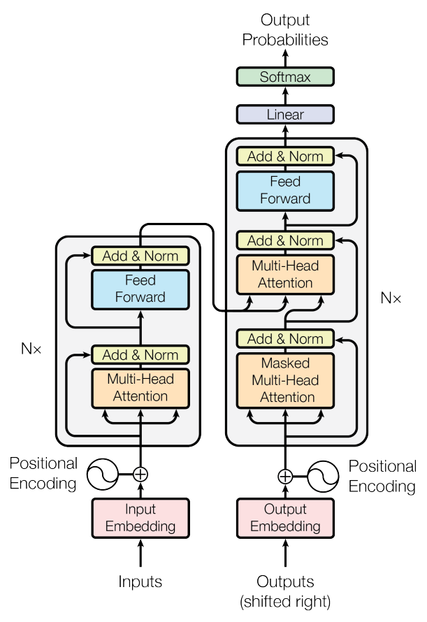

# Architecture Diagrams

[본문으로 이동](../README.md#설계-도면) 

## Legacy-Transformer 아키텍처
[Attention Is All You Need](https://arxiv.org/html/1706.03762v7) 논문에 포함된, 원조 모델 아키텍처 입니다. 

## JK-Transformer 번역 모델 구조
Legacy-Transformer를 이해하기 쉽도록, 조금 더 상세하게 도시한 것일 뿐입니다. 

### Attention 상세
Attention 계층을 더 상세하게, 도시한 것입니다. 

### FFN 상세
FFN 계층을 더 상세하게, 도시한 것입니다. 

[본문으로 이동](../README.md#설계-도면) 
